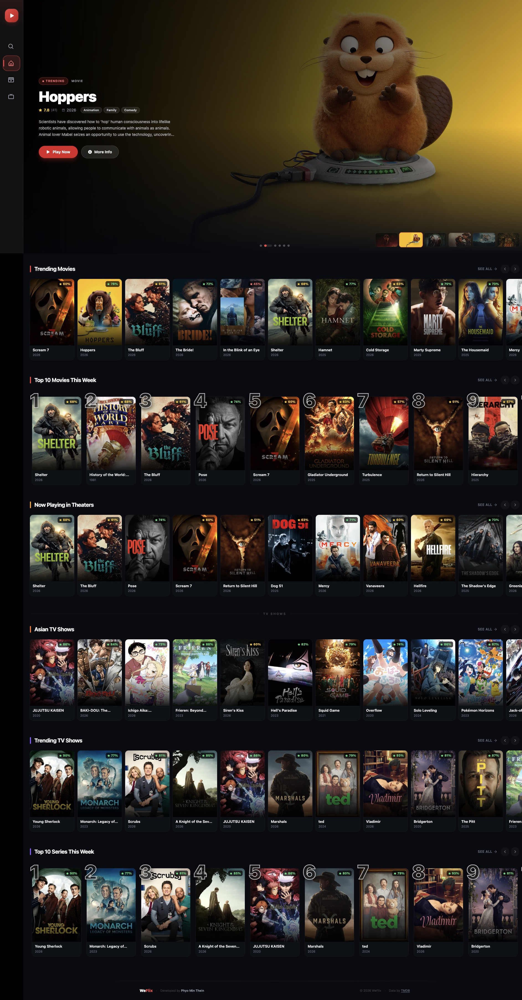

# WeFlix — Movie & TV Streaming App

A modern movie and TV show streaming discovery app built with **React 18**, **Vite**, and **Tailwind CSS**. Browse trending content, filter by genre, search across titles, and watch directly in-browser — all powered by the TMDB API.

## Preview



---

## Features

- **Trending by default** — Movies and TV Shows pages open with this week's trending content from TMDB
- **Sidebar navigation** — Collapsible icon sidebar with genre lists, special categories (Anime, K-Drama, C-Drama, Donghua), and smooth hover-expand
- **Genre filtering** — Browse any genre; URL updates so links are shareable (e.g. `/movies?genre=28`)
- **Sort options** — Sort by Most Popular, Top Rated, Newest, Oldest, or Highest Grossing (movies)
- **Special categories** — Curated filters for Anime, K-Drama, C-Drama, and Donghua on the TV Shows page
- **Global content** — No language restriction; shows movies and shows from all countries
- **Detail pages** — Full-bleed backdrop hero with poster, rating, genres, tagline, overview, and production info at `/movie/:slug` and `/tv/:slug`
- **In-browser player** — Embedded video player on every detail page with click-to-activate scroll overlay
- **Episode selector** — TV detail page includes season tabs and episode cards with thumbnails
- **Search** — Search movies and TV shows with live results; genre chips let you jump directly to a category
- **Infinite scroll** — Content grids load more as you scroll, with skeleton loaders and error handling
- **Slug URLs** — Human-readable URLs like `/movie/550-fight-club` for better sharing
- **User Authentication** — Secure login and signup powered by Firebase Auth
- **Personal Watchlist** — Save your favorite movies and TV shows to a personal, cloud-synced watchlist
- **Continue Watching** — Automatically tracks your viewing progress and displays a quick-resume row on the homepage seamlessly synced with Firestore
- **Dynamic SEO** — Auto-generated layout meta tags, and page titles updating dynamically per context

---

## Tech Stack

| Layer | Technology |
|-------|-----------|
| Framework | [React 18](https://react.dev/) + [Vite](https://vitejs.dev/) |
| Styling | [Tailwind CSS](https://tailwindcss.com/) |
| Routing | [React Router v6](https://reactrouter.com/) |
| Animations | [Framer Motion](https://www.framer.com/motion/) |
| Icons | [react-icons](https://react-icons.github.io/react-icons/) (Boxicons + FontAwesome) |
| Backend & DB | [Firebase](https://firebase.google.com/) (Auth, Firestore DB, Hosting) |
| Data | [TMDB API](https://www.themoviedb.org/documentation/api) |
| Player | [vidlink.pro](https://vidlink.pro/) embedded iframe |

---

## Getting Started

### Prerequisites

- Node.js v18+
- npm or yarn
- A free TMDB API key — [sign up here](https://www.themoviedb.org/signup)

### Installation

1. **Clone the repository:**
   ```bash
   git clone https://github.com/kweephyo-pmt/WeFlix_v2.git
   cd weflix_v2
   ```

2. **Install dependencies:**
   ```bash
   npm install
   ```

3. **Configure environment variables:**

   Create a `.env` file in the project root:
   ```env
   # TMDB Configuration
   VITE_TMDB_API=your_tmdb_api_key_here
   VITE_BASE_URL=https://api.themoviedb.org/3

   # Firebase Configuration
   VITE_FIREBASE_API_KEY=your_firebase_api_key
   VITE_FIREBASE_AUTH_DOMAIN=your_project_id.firebaseapp.com
   VITE_FIREBASE_PROJECT_ID=your_project_id
   VITE_FIREBASE_STORAGE_BUCKET=your_project_id.firebasestorage.app
   VITE_FIREBASE_MESSAGING_SENDER_ID=your_sender_id
   VITE_FIREBASE_APP_ID=your_app_id
   VITE_FIREBASE_MEASUREMENT_ID=your_measurement_id
   ```

   > The app uses Vite's `import.meta.env` — variable names **must** start with `VITE_`.

4. **Start the development server:**
   ```bash
   npm run dev
   ```

The app runs at `http://localhost:5173` by default.

---

## Project Structure

```
src/
├── App.jsx                      # Root router & route definitions
├── main.jsx                     # React entry point
├── index.css                    # Global styles + hide-scrollbar utility
└── pages/Home/
    ├── ParentComponent.jsx      # Layout route — sidebar + scroll-to-top + Outlet
    ├── HomePage.jsx             # Home page — HeroBanner + TrendingRows
    ├── HeroBanner.jsx           # Auto-advancing hero carousel (trending content)
    ├── TrendingRow.jsx          # Horizontal scroll card row
    ├── ContentGrid.jsx          # Infinite-scroll poster grid (trending or by genre)
    ├── ContentCard.jsx          # Poster card with rating badge + hover overlay
    ├── Sidebar.jsx              # Collapsible icon sidebar with genre navigation
    ├── SearchPage.jsx           # Search results + genre/category chips
    ├── Fetcher.js               # All TMDB API calls (trending, discover, details, episodes)
    ├── tmdb.js                  # Genre lists, special category definitions & params
    ├── urlUtils.js              # Slug helpers — toSlug(), toDetailPath()
    ├── Movie/
    │   ├── Movie.jsx            # Movies browse page (trending default, genre + sort filters)
    │   ├── MovieDetails.jsx     # Movie detail page — hero backdrop, player, production info
    │   ├── VideoPlayer.jsx      # Movie iframe player (vidlink.pro) with scroll overlay
    ├── Reused/
    │   ├── DetailPageSkeleton.jsx # Movies browse page (trending default, genre + sort filters)
    └── TV/
        ├── Series.jsx           # TV Shows browse page (trending default, genre + sort filters)
        ├── TvDetails.jsx        # TV detail page — hero, player, season tabs, episode cards
        └── VideoPlayer.jsx      # TV iframe player (vidlink.pro) with scroll overlay
```
